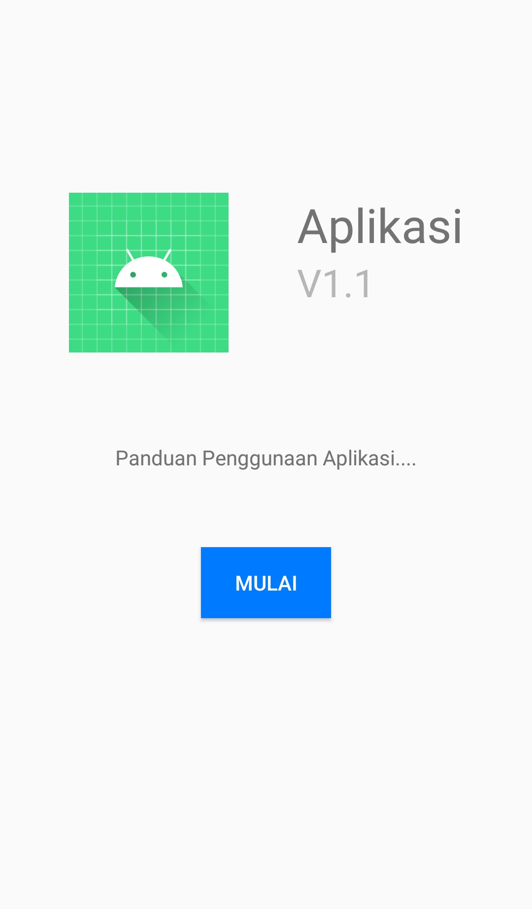
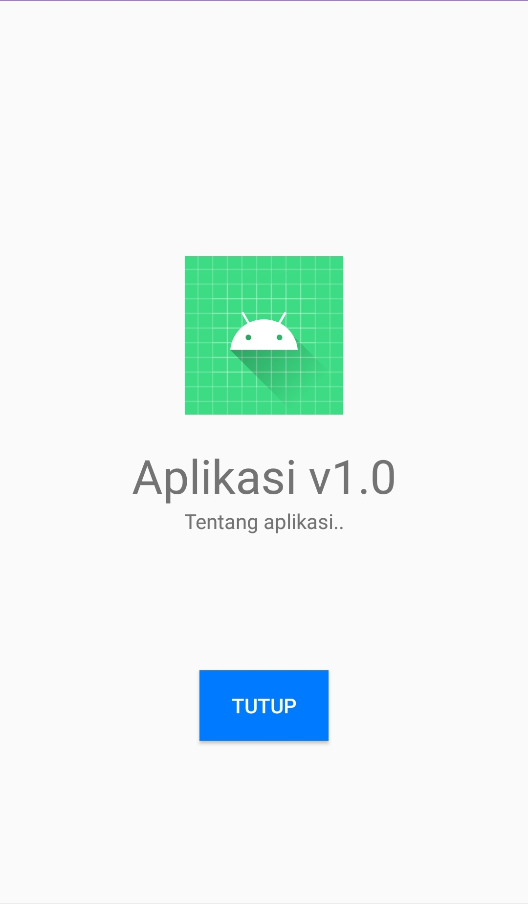
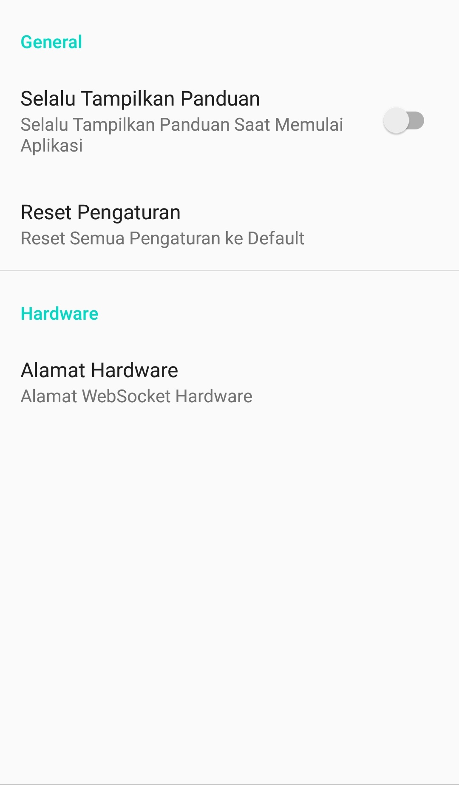
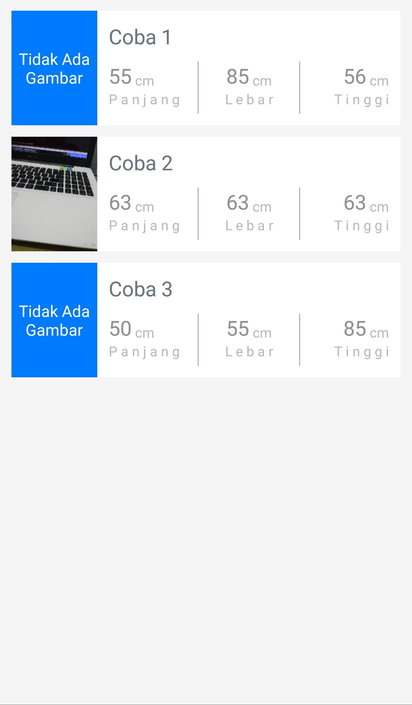
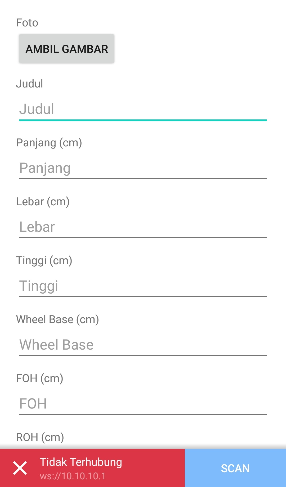
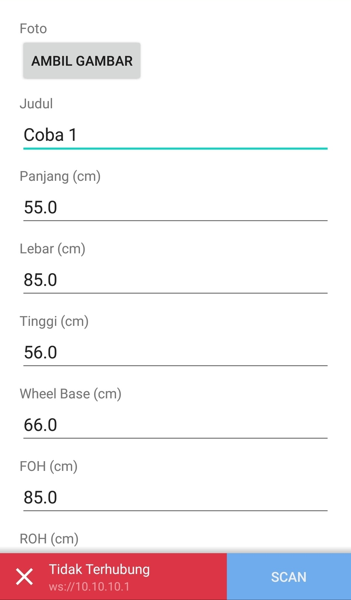
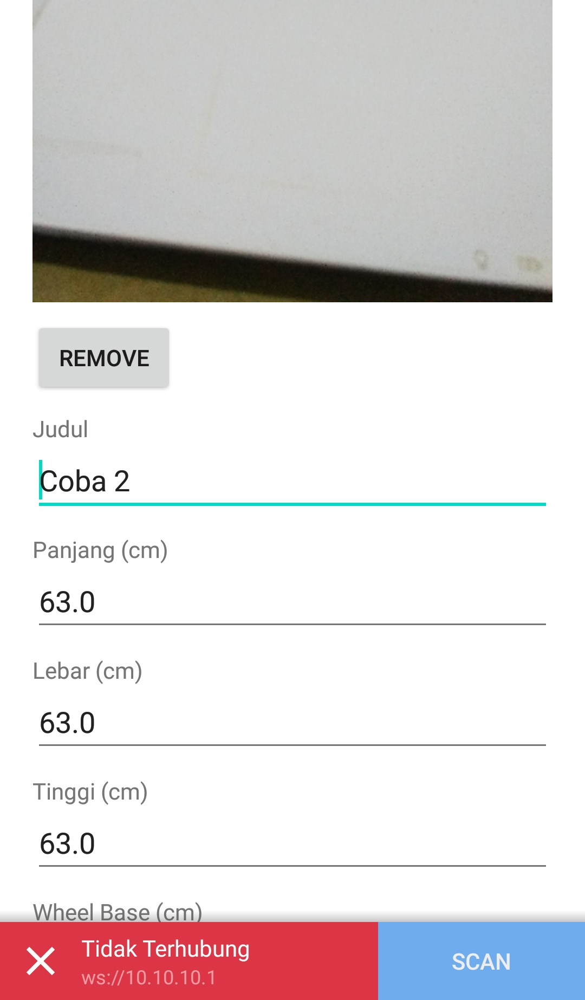

#### Screenshoots-1
Tampilan panduan penggunaan aplikasi

#### Screenshoots-2
Tampilan informasi tentang aplikasi

#### Screenshoots-3
Tampilan pengaturan aplikasi

#### Screenshoots-4
Tampilan daftar pengukuran yang telah tersimpan

#### Screenshoots-5
Tampilan membuat data pengukuran baru

#### Screenshoots-6
Tampilan melihat/mengedit/menghapus data yang tersimpan (tidak ada foto)

#### Screenshoots-7
Tampilan melihat/mengedit/menghapus data yang tersimpan (dengan foto)

