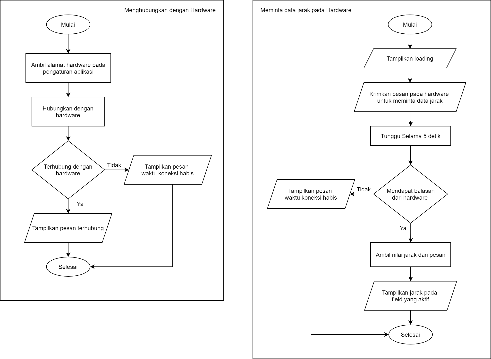
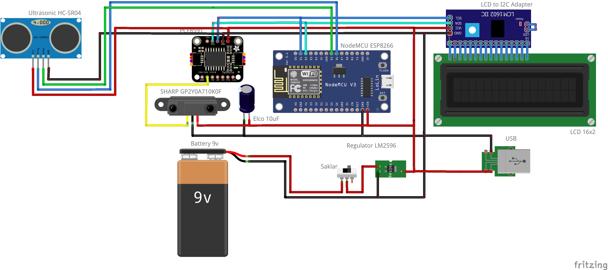
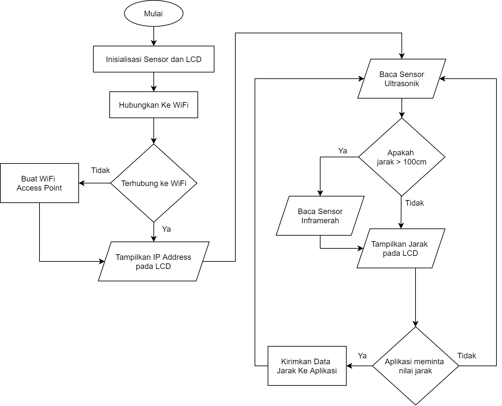

# Measurement Tool
## Android

***Konfigurasi Alamat Hardware***

Alamat Hardware dapat dilihat dari IP Address yang muncul pada LCD hardware 
Misal IP Address Pada LCD adalah `192.168.0.100` maka alamat nya `ws://192.168.0.100`

### Flowchart komunikasi aplikasi



## Arduino

### Komponen
 - NodeMCU ESP8266
 - Sensor Jarak Sharp GP2Y0A710K0F 
 - PCF8591
 - Batterai
 - Saklar
 - LCD 16x2
 - LCD I2C Backpack/LCD to I2C Adapter

### Skema



### Library Program Arduino
 - [ESPAsyncTCP](https://github.com/me-no-dev/ESPAsyncTCP)
 - [ESPAsyncWebServer](https://github.com/me-no-dev/ESPAsyncWebServer)
 - [LiquidCrystal_I2C](https://github.com/johnrickman/LiquidCrystal_I2C)


### Flowchart Program Arduino



#### Konfigurasi WiFi
Terdapat dua mode pada wifi yaitu `Station` dan `Access Pont`

- Station 		: Terhubung ke wifi 
- Access Point 	: Membuat wifi hotspot

Saat dinyalakan Arduino akan mencoba untkuk terhubung ke WiFi yang ditentukan apabila setelah 15 detik arduino tidak terhubung ke WiFi maka arduino akan membuat Hotspot/Access Point sendiri 


***Konfigurasi Wifi pada mode Access Point***
```
const char* AP_WIFI_SSID            = "SoftAP";             //Access Point SSID
const char* AP_WIFI_PASSWORD        = "12345678";           //Access Point Password
```

***Konfigurasi Wifi pada mode Station***
```
const char* WIFI_SSID               = "MyWifi";				//Wifi SSID
const char* WIFI_PASSWORD           = "12345678";			//Wifi Password
```


#### Konfigurasi Sensor

Proses pengukauran dilakukan sebanyak 10 kali untuk mendapatkan nilai yang akurat. Semakin banyak proses pengukuran maka akan semakin akurat tetapi akan memakan waktu lebih lama

***Konfigurasi banyaknya proses pengukuran***
```
const uint8_t SCAN_TIMES            = 10;
```


#### Konfigurasi LCD
***Konfigurasi Alamat LCD bisa disesuaikan dengan LCD yang digunakan***

Untuk mengetahui alamat lcd bisa menggunakan program `I2C_Address_Scaner`
```
const uint8_t LCD_ADDRESS           = 0x27;
```